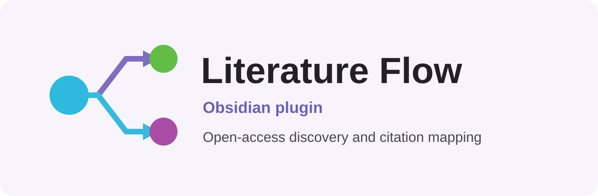

[](LICENSE.md) [](https://github.com/MichelleGDyason/obsidian-literature-flow/releases) [](https://github.com/MichelleGDyason/obsidian-literature-flow/releases) [](https://github.com/MichelleGDyason/obsidian-literature-flow/actions) 

> [!IMPORTANT]
> Literature Flow is a modified version of [anoopkcn/obsidian-reference-map](https://github.com/anoopkcn/obsidian-reference-map), originally created by Anoop K. Chandran. It was renamed and modified on June 6, 2026 to add OpenAlex open access search. See [NOTICE.md](./NOTICE.md) for attribution and modification details.



# Literature Flow

Literature Flow is an [Obsidian](https://obsidian.md/) plugin for open-access literature discovery, reference management, and citation mapping. OpenAlex is the default source, and open-access-only filtering is applied to search, cited and citing works, and the literature graph.

Project documentation is maintained in this README.

<!-- TOC -->
## Contents
1. [Requirements](#requirements)
2. [Installation](#installation)
    - [From Community Plugins](#from-community-plugins)
    - [Manual Installation](#manual-installation)
3. [Usage](#usage)
    - [Literature Flow Sidebar](#literature-flow-sidebar)
        - [Static Reference List](#static-reference-list)
        - [Dynamic Reference List](#dynamic-reference-list)
    - [Literature Flow Search](#literature-flow-search)
    - [Literature Flow Graph](#literature-flow-graph)
4. [Configuration](#configuration)
<!-- /TOC -->

## Requirements

-   [Obsidian](https://obsidian.md/) with community plugins enabled

## Installation
### From Community Plugins

After the plugin is accepted into the Obsidian community directory, install it through **Settings → Community Plugins → Browse → Literature Flow**.

### Manual Installation

1. Download the latest release from [here](https://github.com/MichelleGDyason/obsidian-literature-flow/releases) and unzip it.
2. Copy the `obsidian-literature-flow` folder to your vault's `.obsidian/plugins` folder.
3. Reload Obsidian.
4. Enable the plugin in the community plugins section.

You can also use [BRAT](https://github.com/TfTHacker/obsidian42-brat/) with `MichelleGDyason/obsidian-literature-flow`.

## Usage

This README contains the current installation, usage, and configuration guide.

Main features:

- **Literature Flow Sidebar** - View details of your references in the current document.
- **Literature Flow Search** - Search for references online to create or insert details.
- **Literature Flow Graph** - A graph view showing all the references and their citing/cited references and connection between them.

### Literature Flow Sidebar

Literature Flow Sidebar View contains Index cards and citing/cited cards.

**Index Cards** are detected from the markdown document using ID's(see the _Static Reference List_ section below)

**Citing/cited cards** show a searchable and sortable list of cited and citing papers of a reference contained in the index card.

Each Index card or citing/cited card in the view will show the following information:

| Button | Section                    | Description                                                                                                                                                                    | On Click                                                                                                            |
| ------ | -------------------------- | ------------------------------------------------------------------------------------------------------------------------------------------------------------------------------ | ------------------------------------------------------------------------------------------------------------------- |
| text   | Title                      | Title of the paper                                                                                                                                                             | Open the best available open-access location, or a configured institutional-library link                           |
|        | Abstract                   | Abstract of the paper (Default=OFF)                                                                                                                                            | -                                                                                                                   |
| text   | Authors                    | Authors of the paper                                                                                                                                                           | Open the author's details in the selected metadata source                                                           |
|        | Year                       | Year of publication                                                                                                                                                            | -                                                                                                                   |
| text   | citekey                    | Pandoc citekey (Default=OFF)                                                                                                                                                   | Open reference in the Zotero Library                                                                                |
| (1)    | Metadata copy              | User defined format of metadata. Default=`bibtex` of the paper                                                                                                                 | Copy the `<bibtex>` to the clipboard (If Batch copy is enabled it will copy `<bibtex>` for all the cited paper)     |
| (2)    | Metadata copy              | User defined format of metadata Default=Formatted `metadata` details                                                                                                           | Copy the `<metadata>` to the clipboard (If Batch copy is enabled it will copy `<metadata>` for all the cited paper) |
| (3)    | Metadata copy              | User defined format of metadata. Default=Reference title as `wikilink` (Default=OFF)                                                                                           | Copy the `<wikilink>` to the clipboard (If Batch copy is enabled it will copy `<wikilink>` for all the cited paper) |
| (4)    | PDF                        | Open Access PDF of the paper                                                                                                                                                   | Open the [Open Access](https://de.wikipedia.org/wiki/Open_Access) PDF of the paper if it is present for a reference |
| (5)    | Reference count            | Number of references                                                                                                                                                           | Open a searchable list of all cited papers (References)                                                             |
| (6)    | Citation count             | Number of citations                                                                                                                                                            | Open a searchable list of all citing papers (Citations)                                                             |
|        | Influential citation count | [Number of influential citations](https://www.semanticscholar.org/paper/Identifying-Meaningful-Citations-Valenzuela-Ha/1c7be3fc28296a97607d426f9168ad4836407e4b) (Default=OFF) | -                                                                                                                   |

_You can customize the content of metadata buttons(1,2,3) according to your workflow, possible variables for the metadata template for the buttons copy/create contents are listed in the settings tab_

_Batch operations are exclusive to Index Cards_

#### Static Reference List

Reference IDs (DOI, arxiv, corpusID, URL, citeKey, etc,.) that are found in the current document are listed in the `Literature Flow` view. Valid IDs can be added anywhere in the document and they will be detected.

The following types of IDs are supported:

| ID Syntax       | Description                                              | Example                                                |
| --------------- | -------------------------------------------------------- | ------------------------------------------------------ |
| `DOI:<doi>`     | A [Digital Object Identifier](http://doi.org/).          | `DOI:10.18653/v1/N18-3011` or `10.18653/v1/N18-3011v1` |
| `@<citekey>`    | [Zotero](https://www.zotero.org/) citekey(Default=OFF)\* | `@smith2019attention`                                  |
| `ARXIV:<id>`    | [arXiv.org](https://arxiv.org/)                          | `ARXIV:2106.15928`                                     |
| `MAG:<id>`      | Microsoft Academic Graph                                 | `MAG:112218234`                                        |
| `PMID:<id>`     | PubMed/Medline                                           | `PMID:19872477`                                        |
| `PMCID:<id>`    | PubMed Central                                           | `PMCID:2323736`                                        |
| `URL:<url>`     | URL from sites                                           | `URL:https://arxiv.org/abs/2003.05991`                 |
| `CorpusId:<id>` | Semantic Scholar numerical ID                            | `CorpusId:215416146`                                   |

\*To enable CiteKey support(for Zotero or for other reference managers), Activate `Pull from zotero` option and select a library OR one has to provide a `Bibtex CSL JSON`(Better BibTex Zotero Plugin feature, auto updates with changes in the library) or `CSL JSON`(Generic CSL library from any reference manager) file or `BibTeX` file with `.bib` extension. Once enabled in the settings, the plugin can recognize the `citekey` entries.

> [!IMPORTANT]  
> Make sure in Zotero library DOI field(or the URL field) contains a valid ID. Otherwise metadata from the local Library is shown in the sidebar(with no metadata from online sources)

For Static Reference List, **selecting the ID in the markdown file will highlight the corresponding card** in the Literature Flow Sidebar view.

#### Dynamic Reference List

The Literature Flow Sidebar view can also be configured to show a list of references that correspond to the filename of the note or frontmatter keywords.
_Check out the settings tab to configure the plugin behaviour_

**Example:** For a file named `Attention is all you need.md` cards will be displayed for references that match `Attention+all+need`.

For frontmatter keywords, you can configure a keyword to be used for reference search. By default, the keyword is `keywords`.

**Example:** For a frontmatter given as follows:

```
---
keywords: autoencoders, machine learning
---
```

Cards will be displayed for references that match `autoencoders+machine+learning`.

Dynamic sidebar cards show match-source tags such as `Filename: Attention all need`
or `Frontmatter: keywords: autoencoders machine learning`. Hover a tag to see
the raw query sent to the literature source, so irrelevant results can be traced
back to the filename or frontmatter terms that produced them.

Note that since new references are added to the database regularly the dynamic list might not stay the same each time you open the file. Especially for generic keywords like `machine learning`, `deep learning`, `history` etc.

**This feature can be used for keeping up to date with the latest research in a specific field as well**

### Literature Flow Search

Search for references and citations online to create or insert details. You  can locate  the commands by opening the Obsidian command palette (Ctrl/Cmd + P) and typing `Literature Flow`. By default no hotkeys are se for the commands, but you can easily add them in the Hotkeys tab.

If you select a text in the current document and then issue the command the selected text will be used as the search query.

| Command | Description | Hotkey |
| --- | --- | --- |     
| Literature Flow: Search and Insert | Search for references online to insert details in the current document. | - |
| Literature Flow: Search and Create | Search for references online to create a new markdown file using the details | - |

You can configure the insert template in settings. New notes can use either the inline create template or separate Markdown template files from your vault.

#### Vault templates for new notes

Enable **Use vault templates for new notes** under **Literature Flow settings → Discovery and access**, then select:

- A **Journal article template** for articles and other non-book works.
- A **Book template** for books, monographs, edited books, and book chapters.

Literature Flow reads the selected template without modifying the template file. It replaces supported `{{variables}}` and fills matching YAML fields when their current value is blank, `null`, or ends in `?`. Existing completed YAML values, lists, custom fields, and the note body are preserved.

Supported variables include:

```text
{{title}} {{author}} {{authors}} {{year}} {{journal}}
{{volume}} {{issue}} {{pages}} {{abstract}} {{doi}}
{{url}} {{pdfurl}} {{publisher}} {{publicationType}}
{{publication_type}} {{type}} {{citekey}} {{source}}
{{bibtex}} {{csl}}
```

Common YAML keys filled automatically include `title`, `author`, `authors`, `year`, `journal`, `volume`, `issue`, `pages`, `doi`, `publisher`, `publication_type`, `citekey`, `source_url`, `pdf_url`, `abstract`, and `type`. The generated `type` value is `reading_note`; `publication_type` is `Journal article` or `Book`.

#### Discovery and access

The literature source applies consistently to Search Online, dynamic note searches, sidebar reference and citation lists, and the literature graph:

- **OpenAlex** is the default and supports open-access search and citation traversal.
- **Semantic Scholar** can be selected for its paper index.
- **OpenAlex + Semantic Scholar** queries both sources, removes duplicates, and prefers the OpenAlex record when both describe the same DOI.

**Open access only** is enabled by default. A work flows into Literature Flow only when the selected source supplies a usable open-access location. Clicking its title opens that location directly rather than sending you through a general index page.

Reference and citation counts remain visible at the bottom of expandable sidebar cards. Hovering a count identifies it as **References cited by this work** or **Works citing this reference**. Opening a count loads that list on demand, and entries in those lists can be expanded again.

Affiliated researchers can disable **Open access only** to include restricted works. The optional **Institutional access link template** can then route those title links through a university or library login. Use `{{url}}` for the encoded DOI or publisher destination and `{{doi}}` for the encoded DOI value. For example:

```text
https://ezproxy.example.edu/login?url={{url}}
```

OpenAlex now uses a credit-based API and provides the normal free daily allowance with a free API key. Create one at [openalex.org/settings/api](https://openalex.org/settings/api), then enter it under **Literature Flow settings → Discovery and access**. Unauthenticated usage is intentionally very limited.


### Literature Flow Graph
Open command palette and run `Literature Flow: Open Literature Graph` to open the graph view. Reveal connection between the entries. Size of each node indicating the citations it received

- Click on a node to show the details on top of the graph
- Hover to show the title. 
- Pan to zoom in/out (you can also use node right click to zoom in/out)
- Drag to move the graph
- Drag a node to move it around and fix it in place

> [!IMPORTANT]  
> Literature Flow graph will show details of published papers. It will not show details for entries corresponding to videos, webpages, twitter, etc,. in your local library but it is shown in the sidebar view.

## Configuration

If you want to configure the style of the view you can use the [Obsidian-style-settings](https://github.com/mgmeyers/obsidian-style-settings) plugin.

The settings tab contains options to configure the behaviour of the plugin.

## License

This project is distributed under the [GNU General Public License v3.0](./LICENSE.md). It retains the upstream license and records the rename and OpenAlex changes in [NOTICE.md](./NOTICE.md) and the changelog.

**Please feel free to open an issue if you find any bugs or have any suggestions at [GitHub Issues Page](https://github.com/MichelleGDyason/obsidian-literature-flow/issues)**
